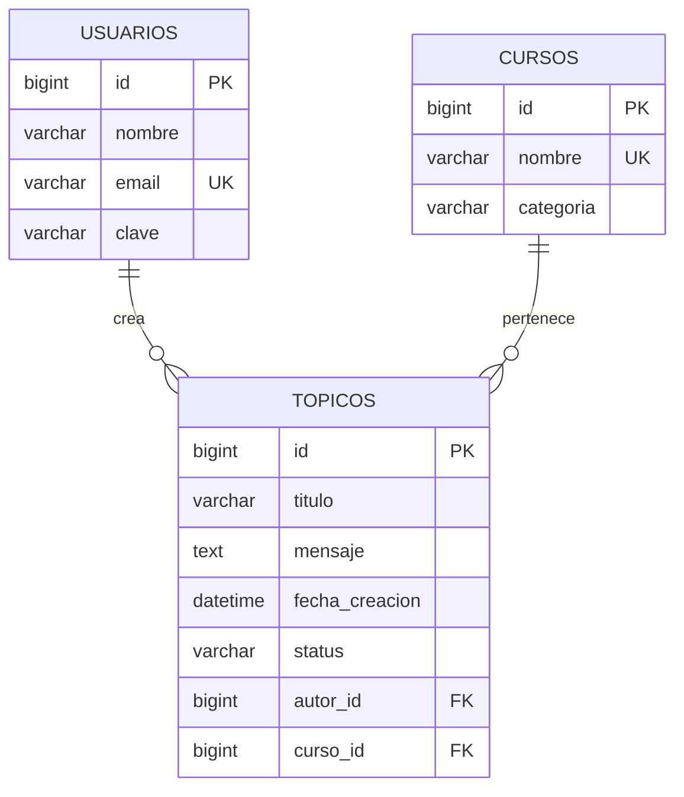
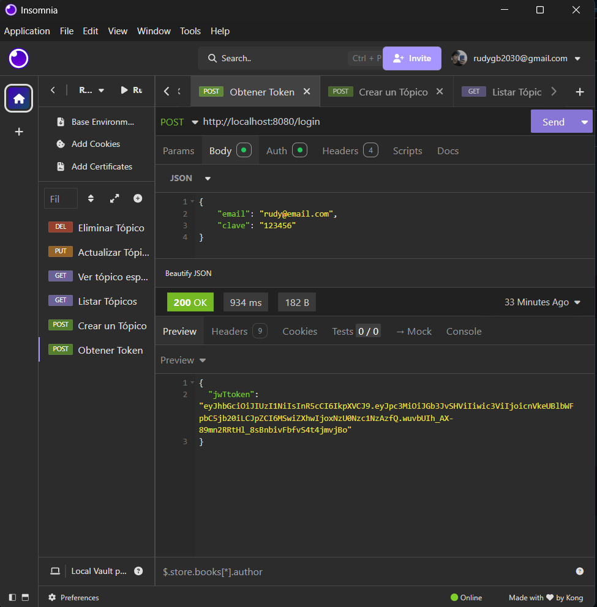

<div align="center">
  
# 🚀 ForoHub

</div>

<div align="center">
  
  
  
  
  
</div>

## 📋 Descripción

**ForoHub** es una API REST desarrollada con Spring Boot que implementa la lógica de un foro en línea. Permite a los usuarios gestionar tópicos de discusión mediante operaciones CRUD (Create, Read, Update, Delete), ofreciendo una base sólida para aplicaciones de debate y gestión de contenidos.

### ✨ Características Principales

- 🔐 **Autenticación JWT**: Sistema seguro de tokens para proteger endpoints
- 📝 **CRUD Completo**: Crear, listar, actualizar y eliminar tópicos
- 🔍 **Búsqueda Avanzada**: Filtros por curso y año
- 📄 **Paginación**: Manejo eficiente de grandes volúmenes de datos
- ✅ **Validaciones**: Reglas de negocio robustas
- 🗄️ **Base de Datos**: Persistencia con MySQL y migraciones Flyway
- 🛡️ **Seguridad**: Spring Security integrado
- 📊 **Documentación**: API bien documentada

---

## 🛠️ Tecnologías Utilizadas

| Tecnología | Versión | Propósito |
|------------|---------|-----------|
| **Java** | 17+ | Lenguaje de programación |
| **Spring Boot** | 3.2.0 | Framework principal |
| **Spring Security** | 6.x | Autenticación y autorización |
| **Spring Data JPA** | 3.x | Persistencia de datos |
| **MySQL** | 8.0+ | Base de datos |
| **Flyway** | 9.x | Migraciones de BD |
| **JWT** | 4.4.0 | Tokens de autenticación |
| **Maven** | 4.x | Gestión de dependencias |
| **Lombok** | 1.18.x | Reducción de código boilerplate |

---

## 🏗️ Arquitectura del Proyecto

```
src/main/java/com/alura/forohub/
├── 📁 controller/          # Controladores REST
├── 📁 domain/              # Entidades y lógica de dominio
│   ├── 📁 topico/         # Gestión de tópicos
│   ├── 📁 usuario/        # Gestión de usuarios  
│   └── 📁 curso/          # Gestión de cursos
├── 📁 infra/              # Infraestructura y configuración
│   ├── 📁 security/       # Configuración de seguridad
│   └── 📁 errores/        # Manejo de excepciones
└── 📁 service/            # Servicios de negocio
```

---

## 📊 Modelo de Base de Datos



---

## 🚀 Instalación y Configuración

### 📋 Prerrequisitos

Antes de ejecutar el proyecto, asegúrate de tener instalado:

- **Java JDK 17+** - [Descargar aquí](https://www.oracle.com/java/technologies/javase/jdk17-archive-downloads.html)
  - Verifica la instalación: `java -version`
- **MySQL 8.0+** - [Descargar aquí](https://dev.mysql.com/downloads/mysql/)
  - Verifica la instalación: `mysql --version`
- **IDE** - IntelliJ IDEA, Eclipse, o VS Code
- **Cliente REST** - [Insomnia](https://insomnia.rest/) o [Postman](https://www.postman.com/)

> **Nota:** Maven se incluye en el proyecto a través del wrapper (`mvnw`), no necesitas instalarlo por separado.


### 📥 Clonar el Repositorio

```bash
https://github.com/rudy-gomez/ForoHub.git
cd forohub-challenge
```

### ⚙️ Configuración de Base de Datos

1. **Crear la base de datos:**
```sql
CREATE DATABASE forohub;
```

2. **Configurar credenciales en `application.properties`:**
```properties
spring.datasource.url=jdbc:mysql://localhost:3306/forohub?createDatabaseIfNotExist=true&serverTimezone=UTC
spring.datasource.username=tu_usuario
spring.datasource.password=tu_password
```

### 🏃‍♂️ Ejecutar la Aplicación
1. Abrir el proyecto en tu IDE favorito
2. Ejecutar la clase `ForoHubApplication.java`

La aplicación estará disponible en: `http://localhost:8080`

---

## 🔐 Autenticación

### Ejemplo en Insomnia

<div align="center">
  
  <p><em>Ejemplo de autenticación exitosa en Insomnia</em></p>
</div>

### Usar el Token

Incluir en el header de las peticiones autenticadas:
```
Authorization: Bearer tu_token_jwt_aqui
```

---

## 📚 Endpoints de la API

### 🔓 Público (No requiere autenticación)

| Método | Endpoint | Descripción |
|--------|----------|-------------|
| `POST` | `/login` | Autenticación de usuario |
| `GET` | `/topicos` | Listar todos los tópicos |
| `GET` | `/topicos/{id}` | Obtener tópico por ID |

### 🔒 Protegido (Requiere JWT)

| Método | Endpoint | Descripción |
|--------|----------|-------------|
| `POST` | `/topicos` | Crear nuevo tópico |
| `PUT` | `/topicos/{id}` | Actualizar tópico |
| `DELETE` | `/topicos/{id}` | Eliminar tópico |

---

## 📄 Licencia

Este proyecto puede emplearse sin restricciones con objetivos educativos.

---

## 📬 Contacto

**Autor:** Rudy Gomez Bellido  
**LinkedIn:** [linkedin.com/in/rudy-gomezbellido](https://www.linkedin.com/in/rudy-gomezbellido)

---

## ⭐ Si te gusta este proyecto, ¡muéstralo con una estrella! ⭐
